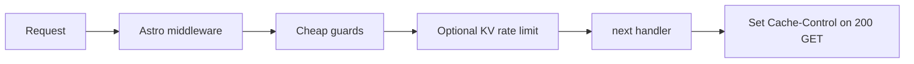

# Worker-layer controls for workers.dev

## How this differs from zone WAF

On **`*.workers.dev`**, traffic does not hit **your** Cloudflare zone, so dashboard WAF/rate rules from [Cloudflare traffic controls (zone)](../cloudflare-traffic-controls.md) do not apply to that hostname. Everything you do must run **inside the Worker** (or via Worker-platform features bound to the script).

Your Worker entry is the Astro server build; the natural hook is [apps/web/src/middleware.ts](../../apps/web/src/middleware.ts), which already sets HTML `Cache-Control` after `next()`.

## 1. Stricter / smarter caching (no bindings)

**Goal:** Fewer repeat invocations for identical URLs (crawlers, prefetch).

- **Tune the existing policy** in [apps/web/src/middleware.ts](../../apps/web/src/middleware.ts): raise `s-maxage` for mostly-static HTML (e.g. `/about`) if editorial churn is low; keep shorter TTL for `/` if the “Updated …” line must stay fresh, or accept staleness for cost.
- **Only set cache on safe responses** (you already require `GET`, `200`, and no existing `Cache-Control`).
- **Optional:** add `Vary` only if you vary responses by headers (usually avoid unless needed; extra `Vary` can hurt cache hit ratio).
- **Workers.dev caveat:** Edge caching behavior is still Cloudflare-managed; strong `Cache-Control` helps, but cache hit ratio may differ from a custom zone. The headers remain worthwhile.

## 2. “Obvious bad pattern” rejection (no bindings)

Run **before** `await next()` in the same middleware (cheap, deterministic).

Examples that are usually safe for a read-mostly catalog:

- **Methods:** For public document URLs (`/`, `/about`, `/locations/*`, `/sitemap.xml`, `/robots.txt`), allow only `GET` (and `HEAD` if you want crawler compatibility — many stacks treat `HEAD` like `GET` for caching).
- **Paths:** Reject `..`, null bytes, absurdly long paths, or junk prefixes if you see them in logs.
- **Query strings:** If the app does not use query params for SSR, cap length or strip/403 on oversized `search` to reduce log-noise and weird caches.
- **User-Agent / bot heuristics:** Use sparingly; easy to block legitimate tools. Prefer rate limits over UA blocklists unless you have evidence.

Return **429** or **403** with a short body; avoid throwing into your SSR path.

## 3. In-Worker rate limiting (KV vs Durable Objects)

### KV (good default)

- **Pattern:** Fixed window or approximate sliding window: key e.g. `rl:${sha256(ip)}:${bucket}` with **increment** + **expiration** (TTL aligned to window).
- **Pros:** Simple, cheap at moderate scale, fits “soft” abuse caps.
- **Cons:** **Eventually consistent** — under rare races you may allow a burst slightly over the limit. Acceptable for cost protection.

### Durable Object (when you need correctness)

- **Use when:** You need strict per-IP (or per-API-key) serialization, or KV’s consistency is too loose.
- **Cons:** More moving parts and **per-invocation billing** for DO; design one DO per logical limiter or shard by hash to avoid a global bottleneck.

### Wiring bindings in this repo

- Today, infra declares the Worker via Alchemy in [packages/infra/alchemy.run.ts](../../packages/infra/alchemy.run.ts) with only `PUBLIC_SERVER_URL`. To add KV (or a DO namespace), you extend the **`Astro(..., { bindings: { ... } })`** (or Alchemy’s documented pattern for KV/DO) so production has `env.RATE_LIMIT` (or similar) available at runtime.
- **Astro middleware:** Read the Cloudflare binding from the adapter runtime (the exact property is adapter-specific — typically via `context.locals` / runtime `env` passed by `@astrojs/cloudflare`). Use that `env` only inside the Worker, not in static build.

## 4. Suggested limits (starting point)

Tune from logs:

- **Global per IP:** e.g. 300 GETs / minute to the worker (or lower on `workers.dev` if you’re getting hammered).
- **Expensive prefixes:** Tighter cap on `/locations/` if those pages are heavier than `/robots.txt`.
- **Response:** **429** with `Retry-After` when over limit.

## 5. When you add a custom domain later

- Keep Worker-layer limits as a **last line of defense** (they still protect origin/Sanity if someone bypasses CDN rules).
- Add zone WAF / rate rules per [Cloudflare traffic controls (zone)](../cloudflare-traffic-controls.md) on the **custom hostname** for cheaper enforcement before the Worker runs.

## 6. Verification

- **Workers Observability** / logs: count 429s, top paths, top IPs.
- **Metrics:** requests and CPU before/after (you already used GraphQL analytics earlier in this project).
- **Sanity:** watch API usage; rate limits should correlate with fewer duplicate SSR fetches for the same IP.

## 7. Risks, disadvantages, and mitigations

| Risk | Why it hurts | Mitigation |
|------|----------------|------------|
| **False positives (429/403)** | Shared IPs (offices, mobile NAT, VPNs) look like one client; strict limits block real users. | Start with generous thresholds; use **Managed Challenge** only at zone later; allowlist paths like `/robots.txt`; monitor 429 rate by ASN/country; add **HEAD** if you block non-GET and crawlers need it. |
| **KV rate limit is approximate** | Eventual consistency can allow short bursts over the nominal cap. | Treat KV as **cost guardrails**, not crypto-grade limits; tighten zone rules on custom domain later; switch hot keys to **Durable Object** only if you need hard ceilings. |
| **KV cost and latency** | Every limited request does extra KV reads/writes; cold keys add latency. | Batch logic (one key per window); short TTLs; skip KV for routes that are already cheap; consider **in-memory** only for per-isolate soft caps (document that it is best-effort). |
| **Durable Object overhead** | More billing, complexity, and failure modes if DO is mis-sharded. | Default to KV; use DO only after measuring; shard (e.g. hash IP) to avoid one global DO. |
| **IP as identity is weak** | `cf-connecting-ip` can be missing or wrong in some setups; attackers rotate IPs. | Still useful against naive crawlers; combine with **path-specific** limits; on custom domain add WAF; optional **Turnstile** only for sensitive actions (this site is mostly read-only). |
| **Middleware runs after some platform behavior** | You still pay for Worker startup to the point middleware runs (small but non-zero). | Zone rules on custom domain stop junk earlier; caching increases share of requests that never hit SSR. |
| **Aggressive caching** | Stale “Updated” copy, wrong language, or rare personalization bugs. | Separate TTLs per route; shorter `s-maxage` on `/` if freshness matters; avoid broad `Vary` unless required. |
| **Method blocking** | Blocking `POST`/`OPTIONS` can break probes, monitoring, or future forms. | Allowlist only what you need; if you add auth/forms later, revisit method rules. |
| **Operational burden** | Thresholds drift as traffic grows; Alchemy/bindings mistakes break deploys. | Document limits in repo; add dashboards/alerts on 429 share; test `wrangler dev` / preview with bindings. |
| **workers.dev remains a weak control plane** | No customer zone WAF in front; abuse still reaches your Worker first. | Accept Worker-layer limits as necessary on workers.dev; **migrate public URL to custom domain** when you want cheaper edge enforcement. |
