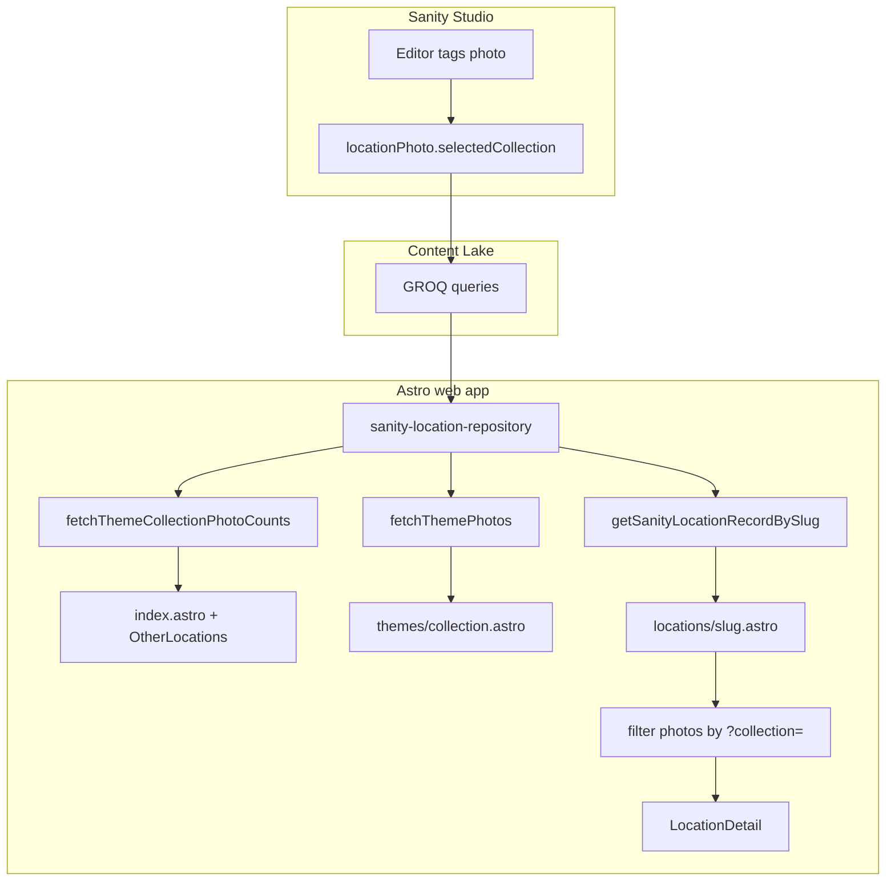

# Selected photo collections (themes)

This document describes how **theme buckets** (Airfields, Bridges, Railroads, Philadelphia Art Museum) are modeled in Sanity, fetched in the Astro app, and surfaced on the homepage, theme index pages, and location galleries.

It is separate from the homepage **“selected photographs” coverflow**, which uses a different flag (`addToSelectedPhotosCollection`). See [selected-photos-coverflow.md](./selected-photos-coverflow.md) for that flow.

## What the user sees

1. **Homepage — Themes section** (`OtherLocations.astro`): links like `Railroads (18)` where the number is the **total count of photos** tagged with that bucket across all places. Each link goes to `/themes/{value}`.
2. **Theme index** (`/themes/railroads`): a **photo grid** of all photographs tagged with that bucket (across all places). Clicking a thumbnail opens the carousel over the full theme set; closing returns to the grid on the same URL.
3. **Location detail** (`/locations/{slug}?collection=railroads`): the photo grid and carousel show **only** photos whose `selectedCollection` matches the query param. The page title includes the theme name when filtering.
4. **Deep link to one photo**: `?photo={photoId}` on theme or location URLs opens the gallery on that slide when the id is in the displayed set (`/themes/{collection}?photo=...` or `/locations/{slug}?collection=...&photo=...`).

Unknown theme slugs (`/themes/not-a-bucket`) return **404**. Valid themes with **zero** tagged photos still render the theme page with an empty-state message (not 404).

## Sanity content model

### Document: `location` (Studio title: “Place”)

Places hold an array of embedded **`locationPhoto`** objects. Theme tagging happens **per photo**, not per place.

### Object: `locationPhoto`

| Field | Type | Role |
| ----- | ---- | ---- |
| **`selectedCollection`** | `string` (dropdown) | Theme bucket: `airfields`, `bridges`, `railroads`, `philadelphia-art-museum`. Studio label: “Selected Photo Bucket”. |
| **`addToSelectedPhotosCollection`** | `boolean` | “Include in Selected Photos” — drives the **homepage coverflow only**, not theme pages. |

**Naming note:** Studio constants live in `selectedPhotoCollections.ts` (`SELECTED_PHOTO_COLLECTIONS`), but the Content Lake field is **`selectedCollection`** (singular). The web app mirrors the constants in [`apps/web/src/lib/selected-photo-collections.ts`](../apps/web/src/lib/selected-photo-collections.ts) and must stay in sync when buckets are added or renamed.

### Distinction: themes vs homepage highlights

```text
selectedCollection          →  /themes/*  →  browse by theme  →  ?collection= on location
addToSelectedPhotosCollection  →  buildSelectedPhotos()  →  homepage coverflow only
```

A photo can be in a theme bucket, in the homepage curated set, both, or neither.

## Routes and query parameters

| URL | Purpose |
| --- | ------- |
| `/` | Themes list with global counts (from Sanity). |
| `/themes/{collection}` | Photo gallery for all photos in `{collection}`. Prerendered at build. |
| `/themes/{collection}?photo={id}` | Theme gallery; carousel opens on `id` if in the theme set. |
| `/locations/{slug}` | Full photo set for the place. |
| `/locations/{slug}?collection={value}` | Gallery filtered to photos where `selectedCollection === value`. |
| `/locations/{slug}?collection={value}&photo={id}` | Filtered gallery; carousel opens on `id` if present in the filtered list. |

`{collection}` must match a value in `SELECTED_PHOTO_COLLECTIONS`. Invalid `?collection=` on a location page is ignored (all photos shown).

## Data flow



### Pipeline (same as other Sanity features)

1. **GROQ** in [`apps/web/src/lib/sanity/queries.ts`](../apps/web/src/lib/sanity/queries.ts) — projections include `selectedCollection` on map and detail queries.
2. **Zod** in [`apps/web/src/lib/sanity/schemas.ts`](../apps/web/src/lib/sanity/schemas.ts) — `selectedCollection` validated against `SELECTED_PHOTO_COLLECTION_VALUES`.
3. **Map** in [`apps/web/src/lib/sanity/map-location.ts`](../apps/web/src/lib/sanity/map-location.ts) — copies non-empty `selectedCollection` onto `LocationPhoto`.
4. **Repository** in [`apps/web/src/lib/sanity-location-repository.ts`](../apps/web/src/lib/sanity-location-repository.ts) — theme-specific fetches and link builders.

## GROQ queries

Defined in [`queries.ts`](../apps/web/src/lib/sanity/queries.ts):

### `themeCollectionPhotoCountsQuery`

Single object with one count per bucket (all locations, all photos):

```groq
{
  "airfields": count(*[_type == "location"].photos[selectedCollection == "airfields"]),
  ...
}
```

Used for homepage labels: `Airfields (4)`.

When adding a bucket in Studio, update this query’s keys **and** `SELECTED_PHOTO_COLLECTIONS` in the web app (and Studio constants).

### `themePlacesQuery`

Parameter: `$collection`. Returns places with at least one matching photo (name, slug, photoCount). Retained for link-building; not used on the theme index page UI.

### `themeLocationsWithPhotosQuery`

Parameter: `$collection`. Returns locations ordered by name, each with a `photos` array filtered to `selectedCollection == $collection` (same fields as `locationForDetailProjection`). Used by `fetchThemePhotos` to build the theme gallery.

### Detail / map projections

`locationForMapProjection` and `locationForDetailProjection` both request `selectedCollection` so location pages can filter client-side after one fetch by slug.

## Repository API

| Function / type | Purpose |
| ----------------- | ------- |
| `fetchThemeCollectionPhotoCounts()` | `ThemeCollectionPhotoCounts` — record keyed by collection value. |
| `buildThemeCollectionLinks(counts)` | `ThemeCollectionLink[]` — `{ title, href: /themes/..., photoCount }` for the homepage. |
| `fetchThemePhotos(collection)` | `LocationPhoto[]` — flattened, ordered photos for the theme index gallery. |
| `fetchThemePlaces(collection)` | `ThemePlaceLink[]` — `{ name, href: /locations/slug?collection=..., photoCount }` (optional link data; not used on theme index UI). |
| `ThemePlaceLink` | Same shape as `OtherLocationPlaceLink`. |

## UI wiring

| File | Role |
| ---- | ---- |
| [`apps/web/src/pages/index.astro`](../apps/web/src/pages/index.astro) | Fetches counts + `buildThemeCollectionLinks`; passes `themes` to `OtherLocations`. |
| [`apps/web/src/components/OtherLocations.astro`](../apps/web/src/components/OtherLocations.astro) | Renders `{theme.title} ({theme.photoCount})` for each bucket. |
| [`apps/web/src/pages/themes/[collection].astro`](../apps/web/src/pages/themes/[collection].astro) | `getStaticPaths()` from constants; `fetchThemePhotos`; `BackToMapLink` + `LocationPhotoGalleryLauncherIsland`; `?photo=` deep link. |
| [`apps/web/src/pages/locations/[slug].astro`](../apps/web/src/pages/locations/[slug].astro) | Reads `?collection=`; builds `displayPhotos`; passes `{ ...location, photos: displayPhotos }` to `LocationDetail`. |
| [`apps/web/src/lib/location-page-seo.ts`](../apps/web/src/lib/location-page-seo.ts) | Optional `collectionTitle` + `displayPhotos` for title and JSON-LD preview images. |
| [`apps/web/src/pages/sitemap.xml.ts`](../apps/web/src/pages/sitemap.xml.ts) | Includes `/themes/{value}` for each constant entry. |

`LocationDetail` does not know about themes; filtering is done in the page frontmatter so the component only receives the photo list to show.

## TypeScript constants

[`selected-photo-collections.ts`](../apps/web/src/lib/selected-photo-collections.ts):

- `SELECTED_PHOTO_COLLECTIONS` — `{ title, value }[]`
- `getSelectedPhotoCollectionTitle(value)` — display name for SEO and headings
- `isSelectedPhotoCollectionValue(value)` — type guard for route params and query strings

Keep this file aligned with the Sanity Studio `selectedPhotoCollections.ts` list options.

## Adding or changing a theme bucket

1. Add the option to the **`selectedCollection`** dropdown in Sanity Studio (`locationPhoto` schema).
2. Update Studio `SELECTED_PHOTO_COLLECTIONS` and web `selected-photo-collections.ts`.
3. Add a key to **`themeCollectionPhotoCountsQuery`** in `queries.ts` (or refactor the query to build counts from the constants array to avoid drift).
4. Redeploy Studio schema if needed; rebuild the site so `getStaticPaths()` picks up the new `/themes/...` path.

Photos without `selectedCollection` do not appear on theme pages; they still appear on the unfiltered location page.

## Operational notes

- **Sparse content:** Theme galleries only include tagged photos; an empty bucket still renders the theme page with an empty-state message. Homepage counts can be `(0)` until editors tag photos.
- **Strict validation:** Unknown `selectedCollection` values in Sanity cause that photo to fail Zod parse and be skipped in `mapSanityLocationToRecord` (logged server-side). Prefer only publishing allowed dropdown values.
- **Prerender:** Theme pages are static HTML at build time; galleries and counts reflect Content Lake at build. Location pages remain server-rendered per slug.

## Related docs

- [sanity-integration.md](./sanity-integration.md) — client, env, GROQ, and mapping patterns
- [selected-photos-coverflow.md](./selected-photos-coverflow.md) — homepage coverflow (`addToSelectedPhotosCollection`)
