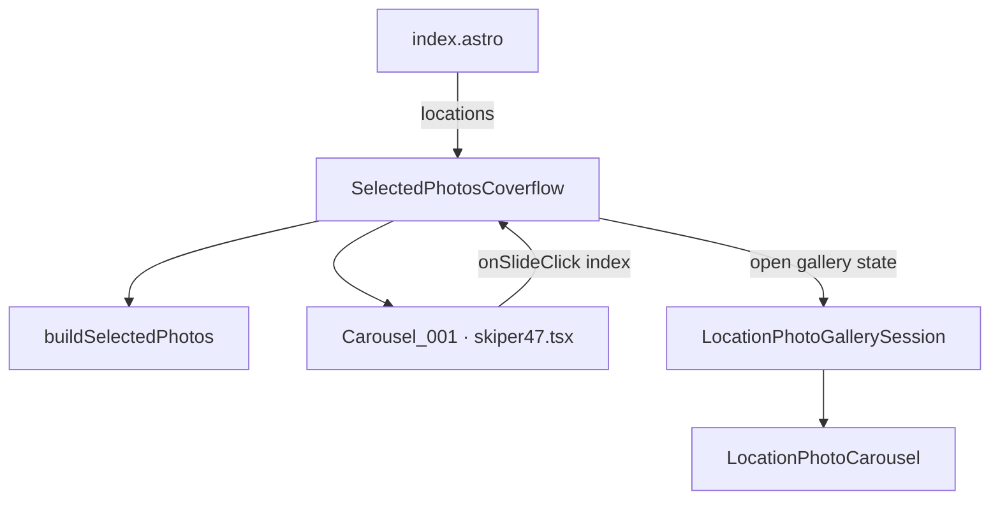

# Selected photographs: coverflow carousel and location gallery

This document describes the **homepage “selected photographs”** experience built from a Swiper-based coverflow carousel (`Carousel_001`) and the existing **location photo gallery** (Embla carousel + metadata). Use it to reimplement the same pattern in another codebase.

## What the user sees

1. **Default state:** A 3D-style **coverflow** carousel shows one curated image per slide, with **title above the image** (here: location name), **pagination dots**, **prev/next arrows**, **loop**, and **autoplay** (this project: **4 seconds** per slide).
2. **Click a slide:** The UI switches to the **full album for that photo’s location**—same carousel + metadata pattern used on individual location pages—not a second small carousel on the home page.
3. **Back:** A button closes the album view and returns to the coverflow.

Cross-location behavior matters: the coverflow is a **flat list** of highlights, but the detail view always uses **`LocationPhoto[]` for one location** and scrolls to the **index of the clicked photo inside that array**.

## Component graph

Mermaid needs a **renderer** (e.g. GitHub, GitLab, many doc sites, or a VS Code / Cursor extension). A plain Markdown preview that only understands CommonMark will show the fence as a code block, not a diagram—so it can look like a “failed” diagram when nothing is wrong with the syntax.

Use **quoted node labels** (`id["Label"]`) and avoid ambiguous text inside unquoted labels (e.g. the word `in` next to identifiers). Prefer an explicit edge **`carousel001 --> cover`** for the slide-click callback instead of **`cover --> cover`**, which some Mermaid builds render poorly.



| Piece | Role |
| ----- | ---- |
| **`SelectedPhotosCoverflow`** | Orchestrates data, coverflow vs gallery mode, and resolves **which location album** + **which index** on slide click. |
| **`buildSelectedPhotos`** | Builds the **ordered flat list** of slides for the coverflow from all locations. |
| **`Carousel_001`** | Swiper coverflow: images + optional titles, autoplay delay, nav, dots, `onSlideClick(index)`. |
| **`LocationPhotoGallerySession`** | Reusable “open gallery” chrome: back button + **`LocationPhotoCarousel`**. |
| **`LocationPhotoCarousel`** | Embla (shadcn `Carousel`) with large image, caption/metadata, prev/next; **`initialPhotoIndex`** + `api.scrollTo` when API is ready. |

**Note:** `LocationPhotoGalleryLauncher` (grid of cards → session) uses the same **`LocationPhotoGallerySession`**; the homepage skips the grid and opens the session directly from the coverflow.

## Data model

### Location and photos (source of truth)

Conceptually you need:

- **`LocationRecord`**: `slug`, `name`, `photos: LocationPhoto[]`, etc.
- **`LocationPhoto`**: at minimum `id`, `src`, `alt`; optional `title`, `caption`, metadata fields.
- A **boolean** on each photo (here: `addToSelectedPhotosCollection`) meaning “include in the curated set.”

### `SelectedPhoto` (coverflow slide payload)

Built by **`buildSelectedPhotos(locations)`**. Important fields:

| Field | Purpose |
| ----- | ------- |
| **`photoId`** | Same as **`LocationPhoto.id`**. Required to find `initialPhotoIndex` via `location.photos.findIndex(p => p.id === photoId)`. Do **not** parse composite `key` strings if slugs can contain delimiters. |
| **`locationSlug`** | Find the parent location: `locations.find(l => l.slug === locationSlug)`. |
| **`src` / `alt` / `locationName`** | Image URL, accessibility, title above image in coverflow. |

### Selection rules (`buildSelectedPhotos`)

1. Walk every location and every photo; tag whether the photo is “selected” for the collection.
2. If **any** photo is selected, the coverflow shows **only those** (filter).
3. If **none** are selected, fall back to a small default set (here: **last five** photos in flattened order).

Porting tip: keep this function **pure** and easy to unit test; the UI only needs the resulting `SelectedPhoto[]` plus the original **`locations`** array for resolving full albums.

## Slide click → gallery (core algorithm)

Inputs: **`photos`** = `buildSelectedPhotos(locations)`, **`realIndex`** from the coverflow (must match array index in `photos`), and **`locations`**.

```text
selected = photos[realIndex]
location = locations.find(l => l.slug === selected.locationSlug)
initialPhotoIndex = location.photos.findIndex(p => p.id === selected.photoId)
```

If any step fails, ignore the click. Otherwise set state, e.g.:

```ts
{ locationSlug, photos: location.photos, initialPhotoIndex }
```

Render **`LocationPhotoGallerySession`** with that `photos` and `initialPhotoIndex`.

### Why `key` on the session

When opening another location or another photo, Embla may keep internal scroll position. This project sets:

```text
key={`${gallery.locationSlug}-${gallery.initialPhotoIndex}`}
```

on **`LocationPhotoGallerySession`** so React remounts the subtree when the context changes, matching the intent of `LocationPhotoCarousel`’s `initialPhotoIndex` effect.

## `Carousel_001` (Skiper-style Swiper) contract

Implemented in **`apps/web/src/components/ui/skiper-ui/skiper47.tsx`** (based on [Skiper UI — Perspective carousel](https://skiper-ui.com/v1/skiper47); free tier requires **attribution**).

**Dependencies:** `swiper`, `framer-motion` (entrance animation on wrapper), icon library for arrows.

**Image shape:**

```ts
type Carousel001Image = { src: string; alt: string; title?: string }
```

**Notable props:**

| Prop | Behavior |
| ---- | -------- |
| `showPagination` / `showNavigation` | Swiper pagination + custom prev/next nodes. |
| `loop` | Infinite loop; slides use `virtualIndex={index}` to align loop duplicates with logical indices when needed. |
| `autoplay` + `autoplayDelay` | Default delay if unset is **1500 ms**; homepage passes **4000**. |
| `onSlideClick(index)` | Fired with the **logical** slide index (same as `images` array order). Implemented via a focusable slide wrapper (`role="button"`, keyboard activation). |
| `slideToClickedSlide` | Enabled so clicking a side slide centers it before or while opening the gallery. |

**CSS:** Swiper modules import `effect-coverflow`, `pagination`, `navigation`, base `swiper/css`. Bullet colors can be themed via scoped CSS (this project uses design tokens in a `<style>` block).

## `LocationPhotoGallerySession`

Props:

- **`photos`**, **`initialPhotoIndex`**, **`onClose`**
- Optional **`closeLabel`** — homepage uses *“Back to selected photographs”*; location flow uses *“Back to photo gallery”*.

Renders: top-aligned back **`Button`** + **`LocationPhotoCarousel`**.

## `LocationPhotoCarousel` (Embla)

- Receives **`photos`** and **`initialPhotoIndex`** (clamped to length).
- Stores **`CarouselApi`** from shadcn **`Carousel`** `setApi`.
- **`useEffect`:** when `api` and `initialIndex` are ready, **`api.scrollTo(initialIndex, true)`**.
- Prev/next buttons live **outside** the `Carousel` root (implementation detail: carousel context).

Porting: any Embla-based carousel with the same `scrollTo` behavior is sufficient; you do not have to keep shadcn’s wrapper.

## Page integration (this repo)

- **Server:** Load `locations` (e.g. from CMS).
- **Client island:** `SelectedPhotosCoverflow` is rendered with **`client:only="react"`** (or equivalent) so Swiper/React hooks run only in the browser—see **`apps/web/src/pages/index.astro`**.

The component expects the **same `locations` array** passed into `buildSelectedPhotos` and into the click resolver.

## Porting checklist

1. **Data:** Per-photo “in collection” flag; stable **`photoId`** on each photo; parent **`slug`** on each location.
2. **Pure builder:** `buildSelectedPhotos` → flat `SelectedPhoto[]` with selection + fallback rules.
3. **Coverflow:** Swiper coverflow (or alternative) with **logical index** on slide activate/click.
4. **Click handler:** `find` location by slug + `findIndex` by `photoId` on `location.photos`.
5. **Detail:** Full **`LocationPhoto[]`** for that location only + **`initialPhotoIndex`**; remount or force scroll when inputs change.
6. **Attribution:** If you keep Skiper-derived UI, retain license/attribution per their terms.
7. **A11y:** Slide click target should be keyboard-accessible if you use click-to-open; keep `alt` text on images.

## File map (this repository)

| File | Purpose |
| ---- | ------- |
| `apps/web/src/components/selected-photos-coverflow.tsx` | Homepage orchestration. |
| `apps/web/src/lib/selected-photos-data.ts` | `SelectedPhoto`, `buildSelectedPhotos`. |
| `apps/web/src/lib/locations.ts` | `LocationRecord`, `LocationPhoto`, `getPhotoMetadataItems`. |
| `apps/web/src/components/ui/skiper-ui/skiper47.tsx` | `Carousel_001`, `Carousel001Image`. |
| `apps/web/src/components/location/location-photo-gallery-session.tsx` | Shared session shell. |
| `apps/web/src/components/location/location-photo-gallery-launcher.tsx` | Grid → same session (location pages). |
| `apps/web/src/components/location/location-photo-carousel.tsx` | Embla carousel + metadata. |
| `apps/web/src/pages/index.astro` | Wires `SelectedPhotosCoverflow` + `locations`. |

The older horizontal strip **`selected-photos.tsx`** is kept as an alternative implementation and is **not** used by the homepage once the coverflow is enabled.
